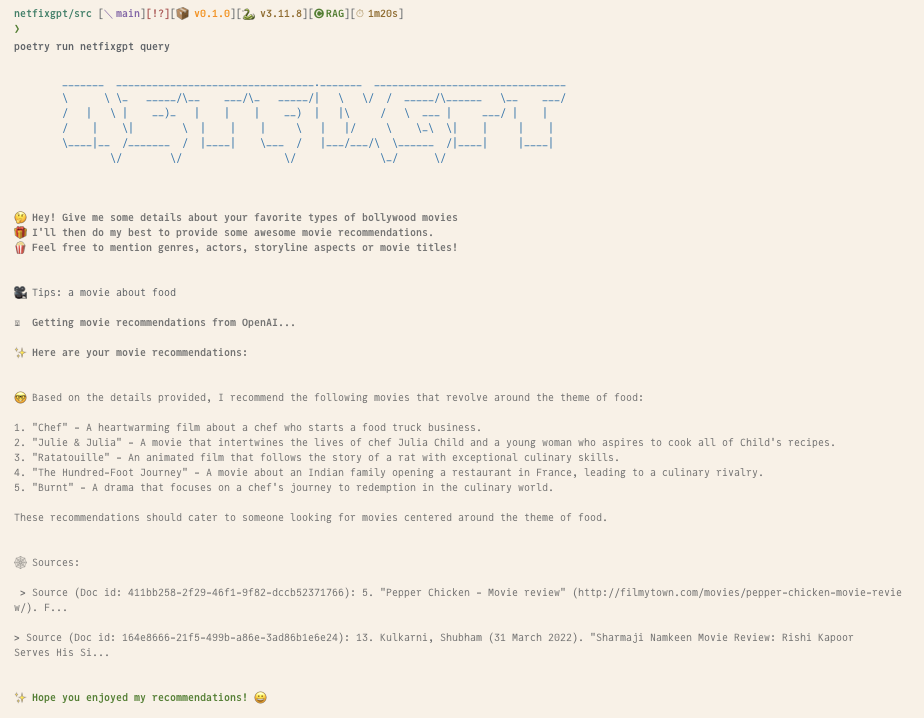
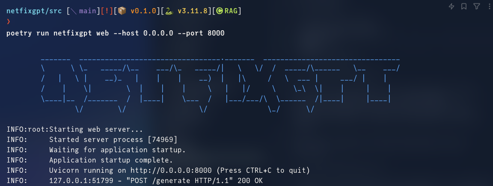
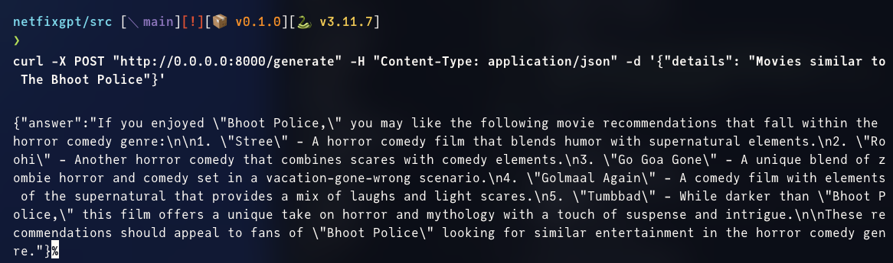

# Movie Recommendation System

## Goals

The goals set for this project are:

- Better recommedations for movies based on more context
- Personalized recommendations
- Up-to-date information
- In-depth information
- More diverse and precise recommendations

## Command Line Interace



## Web Server

The web server is built using FastAPI. The usage is as follows:

1. Running the server:

   ```bash
   $ cd src
   $ poetry run netfixgpt web --host 0.0.0.0 --port 8000
   ```

2. Making curl requests:

   ```bash
   $ curl -X POST "http://0.0.0.0:8000/generate" -H "Content-Type: application/json" -d '{"details": "Movies similar to The Bhoot Police"}'
   ```



3. JSON response:



## Technologies

- ChatGPT 3.5 Turbo 0125
- Text-embedding-ada-002 V2
- Llama Index
- Python
- Jupyter Notebooks

## License and Attribution

This project incorporates text from Wikipedia articles, which are available under the Creative Commons Attribution-ShareAlike License (CC-BY-SA) and, unless otherwise indicated, the GNU Free Documentation License (GFDL).

### Creative Commons Attribution-ShareAlike License (CC-BY-SA)

This license allows you to:

- Share — copy and redistribute the material in any medium or format
- Adapt — remix, transform, and build upon the material for any purpose, even commercially

Under the following terms:

- Attribution — You must give appropriate credit, provide a link to the license, and indicate if changes were made. You may do so in any reasonable manner, but not in any way that suggests the licensor endorses you or your use.
- ShareAlike — If you remix, transform, or build upon the material, you must distribute your contributions under the same license as the original.

For more details, visit: [CC-BY-SA License](https://creativecommons.org/licenses/by-sa/3.0/)

### GNU Free Documentation License (GFDL)

This license allows you to:

- Copy and distribute the document under the terms of the GFDL, either version 1.3 of the License, or (at your option) any later version published by the Free Software Foundation
- No Invariant Sections, no Front-Cover Texts, and no Back-Cover Texts

For more details, visit: [GNU Free Documentation License](https://www.gnu.org/licenses/fdl-1.3.html)

### Attribution

In accordance with the CC-BY-SA and GFDL licenses, the following source must be attributed:

- Source: [Wikipedia, The Free Encyclopedia](https://en.wikipedia.org/)
- Original articles URLs:
  - [Lists of Hindi films](https://en.wikipedia.org/wiki/Lists_of_Hindi_films) (and any articles referecenced recursively)
  - [Lists of American films](https://en.wikipedia.org/wiki/Lists_of_American_films) (and any articles referenced recursively)
