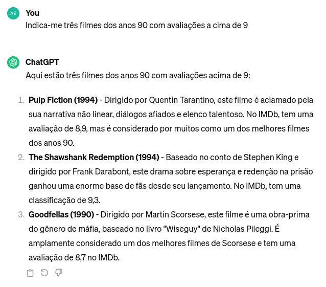

<!-- Custom Nord Theme -->
<style>
  section::after {
    /* Layout of pagination content */
    position: fixed;
    bottom: 0;
    right: 0;
    text-align: right;
    width: 120px;
    height: 120px;
    line-height: 120px;
    letter-spacing: 0.2em;
    padding: 0px;

    /* Triangle background */
    background: linear-gradient(-45deg, rgba(0, 0, 0, 0.05) 50%, transparent 50%);
    background-size: cover;
  
    content: attr(data-marpit-pagination) '/' attr(data-marpit-pagination-total);
  }
  section {
    background-color: #2E3440;
    color: #E5E9F0;
    font-family: 'Segoe UI', Tahoma, Geneva, Verdana, sans-serif;
  }
  h1, h2, h3, h4, h5, h6 {
    color: #88C0D0;
  }
  a {
    color: #81A1C1;
  }
  ul {
    color: #D8DEE9;
  }
  code {
    background-color: #3B4252;
    color: #0f0000;
    padding: 2px 4px;
    border-radius: 4px;
  }
  pre code {
    padding: 8px;
  }
  .split-slide {
    display: flex;
    justify-content: space-between;
  }
  .split-slide > div {
    flex: 1;
  }
</style>

# Projeto de Data Mining
## Movie Chat Bot

Ricardo Oliveira (PG54177) e Millena Freitas (PG54107)

---

## Indice

1. Motivação
2. Fontes de Dados
3. Plano de Trabalho
4. Exemplos de Utilização
5. Avaliação de Desempenho
6. Objetivos Finais

---

## Motivação

- Desenvolver um chat bot capaz de fornecer recomendações de filmes com base em várias métricas, informações sobre atores e filmes em que estes aparecem; 
- Utilizar técnicas de Processamento de Linguagem Natural (NLP) e mineração de dados para compreender o _input_ dos utilizadores e fornecer respostas relevantes e precisas;
- Proporcionar uma experiência interativa e familiar para os utilizadores, facilitando a descoberta de novos filmes e o acesso a informações sobre o mundo do cinema de forma mais rápida e eficiente.

---

## Fontes de Dados

- APIs de serviços de streaming de filmes, como IMDb, TMDb (The Movie Database), etc.
- Bases de dados públicas sobre filmes e séries, contendo informações sobre o _cast_, _plot_, classificações, etc.

---

## Plano de Trabalho

1. Análise critica de LLM preexistentes
2. Obtenção e pré-processamento dos dados
3. Integração da LLM com as fontes de dados selecionadas
4. Desenvolvimento da interface do chat bot e a sua integração com a LLM
5. Testes e avaliação de desempenho
6. Ajustes e refinamentos à LLM, baseados nos resultados dos testes realizados

---

## Exemplos de Utilização
#### Pergunta:
Indica-me três filmes dos anos 90 com avaliações acima de 9

<div class="split-slide">
    <div>

### Objetivo:

```
1. The Shawshank Redemption:
  - Ano: 1994
  - Duração: 2h 22m
  - Avaliação: 9.3 (2.9M)
  - Sinopse: Over the course of...
2. Schindler's List:
  - Ano: 1993
  - Duração: 3h 15m
  - Avaliação: 9.0 (1.4M)
  - Sinopse: In German-occupied Poland...
3. Ramayana: The Legend of Prince Rama:
  - Ano: 1992
  - Duração: 2h 15m
  - Avaliação: 9.2 (14K)
  - Sinopse: An anime adaptation of...
```
Exemplo de resposta esperada

  </div>
  <div>

### Exemplo Atual:

  

Fig.1: Pergunta realizada ao *ChatGPT* 3.5

  </div>
  
  
  <div>

### Correto:

  

Fig.2: Filmes dos anos  90 com avaliação 9+ IMBD
  
  </div>

</div>

---

## Avaliação de Desempenho

- Testes de _benchmark_ para avaliar a precisão e eficiência do chat bot;
- Comparação com outros chat bots existentes, como o ChatGPT, Blackbox.ai, etc.;
- Análise de _feedback_ dos utilizadores para identificar pontos fortes e fracos.

---

## Objetivos Finais

1. Desenvolver um chat bot funcional e preciso com conhecimento extenso sobre filmes;
2. Fornecer aos usuários uma experiência prática e intuitiva;
3. Oferecer recomendações de filmes relevantes para as pesquisas dos utilizadores;
4. Facilitar a descoberta de novos filmes e o acesso a informações sobre cinema de forma rápida e eficiente;

---

# Projeto de Data Mining
## Movie Chat Bot

Ricardo Oliveira (PG54177) e Millena Freitas (PG54107)

